<div align="center">


<br/>

<a href="https://www.linkedin.com/in/yash-ransubhe-252258287"></a>
<a href="mailto:yashransubhe@gmail.com"></a>
<a href="https://github.com/yashransubhe-prog?tab=repositories"></a>

<br/><br/>


</div>

---

## `01 // IDENTITY`

<table>
<tr>
<td width="62%" valign="top">

### Hello — I'm Yash.

A **Computer Science Engineering student and Full-Stack Developer** interested in the point where software engineering, cybersecurity, cloud architecture and product design meet.

I like taking an idea beyond the mock-up stage: designing the interface, building the logic behind it, connecting data, debugging the failures and finally getting the system deployed.

My current learning path is deliberately broad: **stronger core CS + Java/DSA + full-stack engineering + security + cloud**.

</td>
<td width="38%" valign="top">

```yaml
name: Yash Ransubhe
education: B.Tech CSE
college: NSRIT
period: 2024 — 2028

focus:
  - Full-Stack Development
  - Cybersecurity
  - Cloud Architecture
  - Product Engineering

status: building
```

</td>
</tr>
</table>



---

## `02 // FIELD NOTES`

Based on my public professional profile, my work spans more than one type of software:

<table>
<tr>
<td width="33%" valign="top">

### 🎧 Audio Engineering
**Cosmos Music**

Cross-platform audio application work using Flutter/Dart, with attention to UI rendering, state management, local file indexing and performance.

</td>
<td width="33%" valign="top">

### 🔐 Digital Security
**The Neo Vault**

A security-oriented mobile utility direction focused on digital footprint management, privacy, secure storage and stronger device-level protection concepts.

</td>
<td width="33%" valign="top">

### ⚡ Real-time Products
**EventSnap**

Real-time event-sharing architecture using Firebase/Cloud Firestore concepts, external media delivery and asynchronous image-loading work.

</td>
</tr>
</table>

### 🏆 Signal from outside GitHub

**First Place — Internal Hackathon for Smart India Hackathon (SIH) 2025**  
NSRIT in collaboration with AICTE.

---

## `03 // ENGINEERING CONSOLE`

<div align="center">


<br/><br/>

| BUILD | DATA | SYSTEMS | LEARNING |
|:---:|:---:|:---:|:---:|
| React · Flutter · TypeScript | PostgreSQL · Prisma · Firebase | Git · GitHub · REST APIs | Java · DSA · Security · AWS |

</div>

> I don't treat this icon wall as a claim of mastery. It is a map of technologies I have used or am actively learning.

---

## `04 // PROJECT TRANSMISSIONS`

<table>
<tr>
<td width="50%" valign="top">

### 🛡️ NEO VAULT SECURITY
**Security / privacy engineering**

A project space for exploring defensive software, privacy-oriented utilities and secure product thinking.

[**ENTER REPOSITORY →**](https://github.com/yashransubhe-prog/Neo-Vault-Security)

</td>
<td width="50%" valign="top">

### 🎵 COSMOS MUSIC ENGINE
**Cross-platform media experience**

A music-product direction connected to my work on cross-platform audio, local libraries and responsive interfaces.

[**ENTER REPOSITORY →**](https://github.com/yashransubhe-prog/Cosmos-Music-Engine)

</td>
</tr>
<tr>
<td width="50%" valign="top">

### 🏔️ JEEVANSETU
**AI / emergency-response prototype**

Work around an AI-assisted landslide and emergency-response use case developed in a hackathon context.

[**ENTER REPOSITORY →**](https://github.com/yashransubhe-prog/jeevansetu)

</td>
<td width="50%" valign="top">

### 🧪 SOFTWARE INVESTIGATION
**Developer tooling / security**

An active engineering experiment around understanding repositories, evidence and software behavior.

[**EXPLORE MY REPOSITORIES →**](https://github.com/yashransubhe-prog?tab=repositories)

</td>
</tr>
</table>

---

## `05 // VERIFIED LEARNING`

<div align="center">

| Credential / Learning Area | Signal |
|---|---|
| **Cisco Cybersecurity Essentials** | Security foundations |
| **Introduction to Cybersecurity — Cisco** | Cybersecurity fundamentals |
| **AWS Solutions Architect Associate learning** | Cloud architecture direction |
| **B.Tech Computer Science & Engineering — NSRIT** | Core CS foundation |

</div>

---

## `06 // GITHUB TELEMETRY`

<div align="center">


<br/>


</div>

---

## `07 // CURRENT MISSION`

```text
[ CORE CS ] ──────► stronger fundamentals
     │
     ├──► [ JAVA + DSA ] ──────► interview problem solving
     │
     ├──► [ FULL STACK ] ──────► production-ready software
     │
     ├──► [ SECURITY ] ────────► safer systems
     │
     └──► [ CLOUD ] ───────────► scalable architecture

                          ↓
                   SOFTWARE ENGINEER
```

I am currently in the phase where I want every new project to teach me something deeper than UI alone: architecture, performance, security, data flow, deployment or debugging.

---

## `08 // CONNECT`

<div align="center">

### Want to talk about software, projects, hackathons or engineering?

<a href="https://www.linkedin.com/in/yash-ransubhe-252258287"></a>
<a href="mailto:yashransubhe@gmail.com"></a>

<br/><br/>


### `BUILD → TEST → BREAK → LEARN → REBUILD`

<sub>Designed as a living engineering profile. Dynamic GitHub signals update as the work changes.</sub>

</div>
